# IxDRL

> `IxDRL`: **I**nterestingness analysis for e**x**plainable **D**eep **RL** toolkit

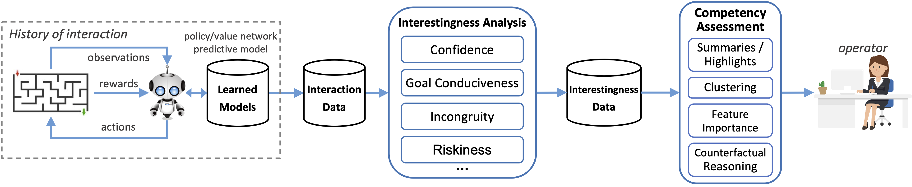

 [](LICENSE.md) [](https://arxiv.org/abs/2307.08933)

# Table of Contents

- [Citing](#citing)
- [Installation](#installation)
- [1. Agent Training (Optional)](#1-agent-training-optional)
- [2. Interaction Data Collection](#2-interaction-data-collection)
  - [Extending](#extending)
  - [RL-Lib Usage](#rl-lib-usage)
  - [Statistics and Visualizations](#statistics-and-visualizations)
  - [Example](#example)
- [3. Interestingness Analysis](#3-interestingness-analysis)
  - [Extending](#extending)
  - [Usage](#usage)
  - [Statistics and Visualizations](#statistics-and-visualizations)
  - [Example](#example)
- [4. Clustering Traces (Optional)](#4-clustering-traces-optional)
  - [Example](#example)
- [5. Highlights](#5-highlights)
  - [Usage](#usage)
  - [Example](#example)
- [6. Feature Importance](#6-feature-importance)
  - [Usage](#usage)
  - [Global Analysis](#global-analysis)
  - [Local Analysis](#local-analysis)
  - [Example](#example)
- [7. GUI Tool](#7-gui-tool)
  - [Usage](#usage)
- [License Notice](#license-notice)
- [Support](#support)
- [Acknowledgements](#acknowledgements)

# Citing

This code corresponds to the implementation of the interestingness toolkit described in this [paper](https://doi.org/10.1007/978-3-031-44064-9_20) ([arXiv version](https://arxiv.org/abs/2307.08933)). The paper explains the goal behind this toolkit, the interestingness dimensions' rationale, and contains experiments using the code on different simulation platforms and the corresponding analysis. 

Please cite the paper if you use this code in your research:

```latex
@InProceedings{10.1007/978-3-031-44064-9_20,
  author="Sequeira, Pedro and Gervasio, Melinda",
  editor="Longo, Luca",
  title="IxDRL: A Novel Explainable Deep Reinforcement Learning Toolkit Based on Analyses of Interestingness",
  booktitle="Explainable Artificial Intelligence",
  year="2023",
  publisher="Springer Nature Switzerland",
  pages="373--396",
  isbn="978-3-031-44064-9"
}
```

# Installation

```bash
git checkout https://github.com/SRI-AIC/IxDRL.git
cd IxDRL
pip install -e .
```

Python installation options:

- `[rllib]`: will install `ray` and necessary dependencies. Select this option to use `IxDRL` to analyze policies trained with the [RLLib](https://docs.ray.io/en/latest/rllib/index.html) toolkit.

- `[gui]`: will install `streamlit` and necessary dependencies. Select this option to run the interestingness and agent behavior visualization GUI tool.

<u>*Note:*</u> the code has been tested on Python 3.10 running on Linux and Mac.

# 1. Agent Training (Optional)

The input to the `IxDRL` framework is a policy trained via deep Reinforcement Learning. This toolkit supports the analysis of policies trained using [RLLib](https://docs.ray.io/en/latest/rllib/index.html) out-of-the-box. As explained in the next section, we need to implement the necessary data collectors for any other RL toolkit.

As for RLLib, see the documentation to train an agent using one of the implemented RL algorithms. In `scripts/01_train.sh` we provide an example of training a policy using the *Distributional Q algorithm* on the *ATARI Breakout* environment.

<u>*Note:*</u> you will need to install either `torch` or `tensorflow` to train the agent.

Running:

```bash
source scripts/01_train.sh
```

will train the agent and store the corresponding results and checkpoint files under `output/breakout-dist-dqn`.

<u>*Note:*</u> this code was tested with `ray==2.9.2`. See `requirements.txt` for specific versions of the Python packages used during testing.

# 2. Interaction Data Collection

After training an RL policy, we test it by deploying it in the environment a number of times under different initial conditions, resulting in a set of *rollouts*. As the agent interacts with the environment, we probe the learned models and collect various information about the agent�fs behavior and internal state, e.g., the value attributed to a state, or the probability each action has of being selected?we refer to all this information as the *interaction data*. 

In the `IxDRL` toolkit, the `ixdrl.InteractionData` class is used to create objects storing the interaction data collected for a rollout that are supported by our interestingness extractors (detailed in the next section). The `ixdrl.Rollout` class packages information about a rollout in addition to the collected interaction data, such as details about the environment's action and observation spaces, the path to the video file of the sampled rollout, etc., which are used by different components of the `IxDRL` framework. 

## Extending

To collect interaction data, we should subclass  `ixdrl.data_collection.InteractionDataCollector` by implementing the `collect_data` method, e.g.:

```python
def collect_data(self, num_rollouts: int) -> Rollouts:
    rollouts = []
    for r in range(num_rollouts):
        data = []
        for t in range(self.rollout_length):
            # collect the available interaction data
            datapoint = InteractionData(...)
            data.append(datapoint)
        rollout = Rollout(str(r), data, ...)
    return {r.rollout_id: r for r in rollouts}
```

## RL-Lib Usage

As mentioned above, the `IxDRL` toolkit supports the analysis of policies trained using [RLLib](https://docs.ray.io/en/latest/rllib/index.html). The python script to collect interaction data given a trained RL-Lib policy is at `ixdrl/bin/collect/rllib.py`:

```bash
python -m ixdrl.bin.collect.rllib
    checkpoint
    --run RUN 
    --output OUTPUT
    [--render] 
    [--episodes EPISODES] 
    [--config CONFIG]  
    [--stats-only STATS_ONLY]
    [--img-format IMG_FORMAT]
    [--labels-file LABELS_FILE] 
    [--fps FPS] 
    [--clear CLEAR] 
    [--verbosity VERBOSITY]
```

where:

- `checkpoint`: RL policy checkpoint from which to rollout and collect data.
- `output`: The path to the directory in which to save the collected interaction data.
- `run`: The algorithm or model to train. This may refer to the name of a built-in algorithm (e.g. RLlib's DQN or PPO), or a user-defined trainable function or class registered in the tune registry.
- `render`: Render the environment while evaluating.
- `episodes`: Number of complete episodes to roll out.
- `config`: Algorithm-specific configuration (e.g. env, hyperparams). Gets merged with loaded configuration from checkpoint file.
- `stats_only`: Whether to use previously-collected data and print stats only. If `True` but the data file cannot be found, then will still collect the data.
- `img_format`: The format of produced image files.
- `labels_file`: The path to a JSON file containing specifications for the action and observation labels of custom environments.
- `fps`: The frames per second rate used to save the episode videos.
- `clear`: Clear output directories before generating results.
- `verbosity`: Verbosity level.

This script produces a pickle file named `interaction_data.pkl.gz` in the output directory containing all interaction data collected given the RL policy. It also produces several plots and data with statistics about the collected data (see details below).

## Statistics and Visualizations

We can use the python function `ixdrl.data_collection.print_stats` to produce plots and data files with different statistics about the given interaction data, including the mean reward received over the course of an episode, the mean action distribution and frequency, the mean observation values, etc, e.g.:

| 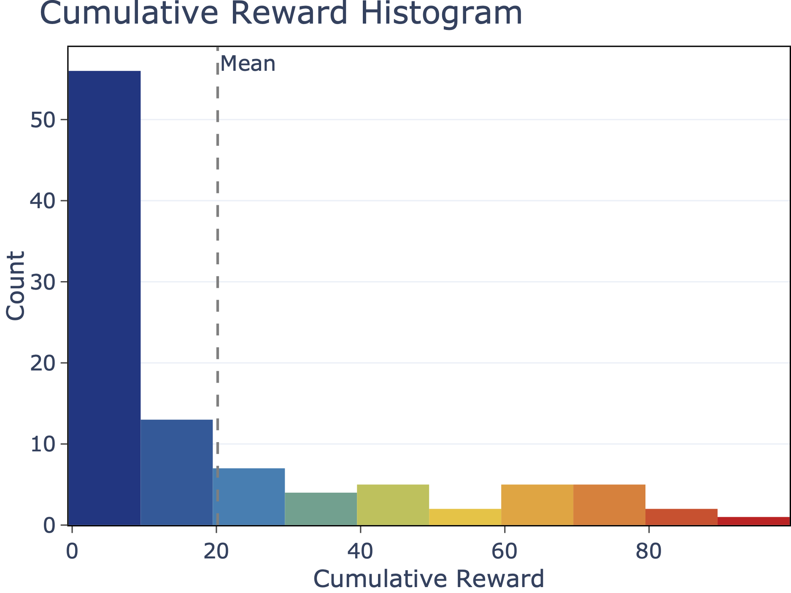 | 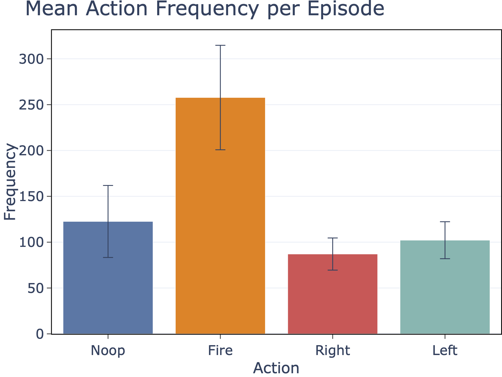 |
| ------------------------------------------------- | ------------------------------------------------------- |

## Example

We provide a ready-to-use shell script available in `scripts/02_collect.sh` to extract interaction data from the RL policy in the Breakout environment trained using the `scripts/01_train.sh` script.

<u>*Note:*</u> rename the directory created by the previous script, named `"DQN_ALE_Breakout-v5..."` to `"model"` before executing the data collection script.

# 3. Interestingness Analysis

The core of the `IxDRL` framework is the performance of interestingness analysis to characterize an RL agent's competence along various dimensions, each capturing a distinct aspect of the agent�fs interaction with the environment. The paper details which dimensions are analyzed by the toolkit and which interaction data artifacts are required for each analysis.

The code that extracts interestingness for each supported dimension given interaction data can be found under `ixdrl/analysis`:

```shell
riskiness.py
confidence.py
goal_conduciveness.py
stochasticity.py
familiarity.py
incongruity.py
value.py
```

## Extending

To extend the framework and create novel analyses of interestingness (new dimensions), we need to subclass `ixdrl.analysis.AnalysisDimensionBase` and implement the `analyze` method:

```python
def analyze(self, rollouts: Rollouts) -> Optional[RolloutsAnalyses]:
    ...
```

which should return a `RolloutsAnalyses` object containing the extracted interestingness for the new dimension for *each* timestep of *each* rollout/episode of collected data.

## Usage

To extract interestingness for all dimensions given interaction data we should run the python script at `ixdrl/bin/analyze.py`:

```shell
python ixdrl.bin.analyze
    --input INPUT 
    --output OUTPUT 
    [--img-format IMG_FORMAT] 
    [--derivative_accuracy DERIVATIVE_ACCURACY] 
    [--processes PROCESSES] 
    [--clear CLEAR]
    [--verbosity VERBOSITY]
```

where:

- `input`: Pickle file containing the interaction data collected using `bin.collect.*` scripts.
- `output`: Directory in which to save results.
- `img_format`: The format of image files.
- `derivative_accuracy`: The accuracy used by finite difference methods. Needs to be a positive, even number.
- `processes`: The number of parallel processes to use for this analysis. A value of `-1` or `None` will use all available CPUs.
- `clear`: Clear output directories before generating results.
- `verbosity`: Verbosity level.

This script produces a pickle file named `interestingness.pkl.gz` containing all interestingness data computed from the input interaction data.

## Statistics and Visualizations

In addition to saving the interestingness data file, the above script produces plots and data files with different statistics about the interestingness extracted from the collected policy rollouts under the `/stats` subdirectory. This includes correlation matrices between the different interestingness dimensions, the mean interestingness over the course of rollouts and the interestingness profiles, e.g.:

| 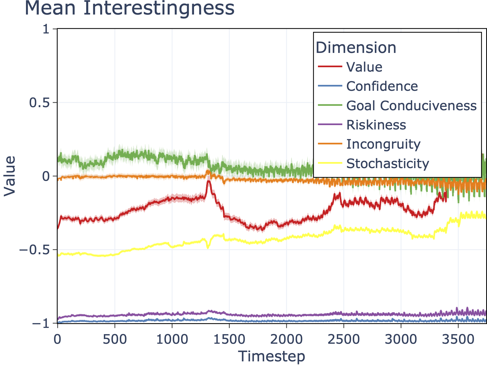 | 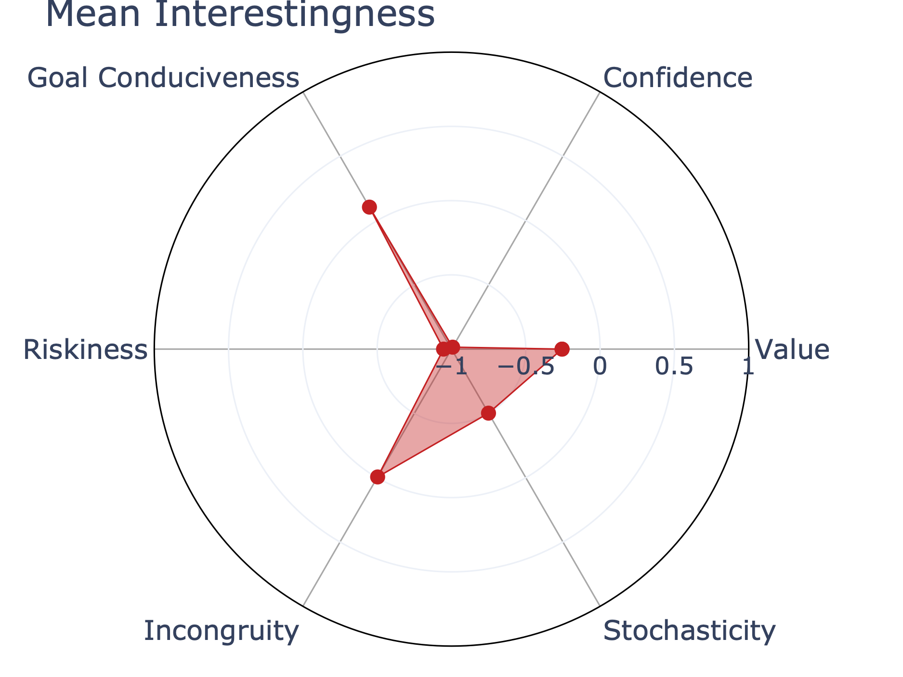 |
| -------------------------------------------------- | --------------------------------------------------- |

## Example

We provide a ready-to-use shell script, `scripts/03_interestingness.sh`, to compute interestingness given the interaction data of the RL policy in the Breakout environment collected using the `scripts/02_collect.sh` script.

# 4. Clustering Traces (Optional)

In our framework, one of the approaches to help identify distinct, meaningful behavior patterns of RL agents (which could indicate that an agent has achieved some level of competence) is by performing trace clustering solely based on interestingness (see the paper for more details).

To cluster traces based on interestingness, we use the *Trace Clustering* toolkit available at: https://github.com/SRI-AIC/trace-clustering, which supports clustering sequences of data (one or more features), in particular numeric data, corresponding to the data resulting from the interestingness analysis, i.e., an interestingness value for each timestep of each episode, for each dimension (feature). See the documentation to install the python package and see which clustering options are available.

Once we have clustered the RL agent rollouts using interestingness, we can use the script available at `ixdrl/bin/copy_videos.py` to copy a random subset of videos sampled from each cluster (if available). 

We can also analyze interestingness per cluster to help assess the competency of the RL agent at different regions of the task space, as dictated by the discovered clusters. To do that we use the script available at `ixdrl/bin/analyze_by_cluster.py`, which will produce plots and data files with different statistics about the interestingness extracted for each cluster under the corresponding `/cluster-X` subdirectory. In addition, plots comparing the interestingness attained in each cluster are generated and stored under the `/comparison` subdirectory, e.g.:

| 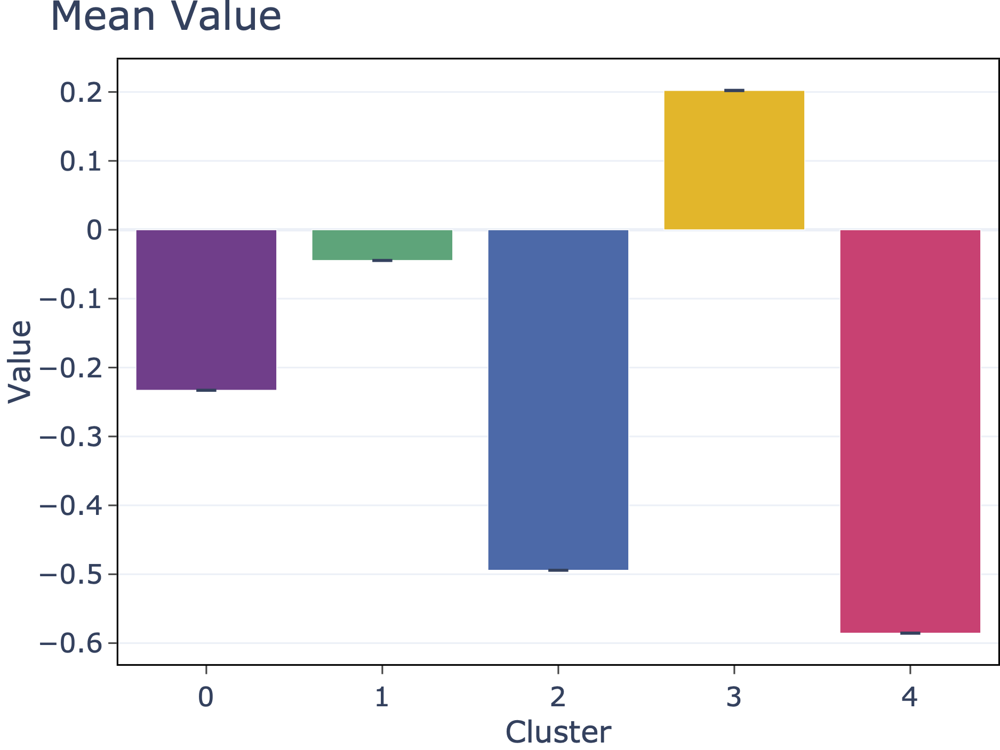 | 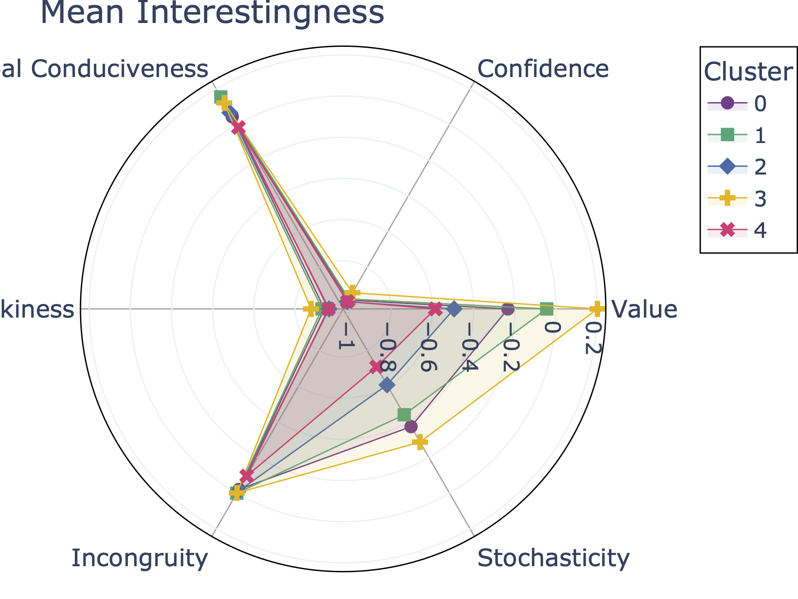 |
| ----------------------------------------------------------- | ----------------------------------------------------------- |

## Example

We provide a shell script available at `scripts/04_cluster_traces.sh` to cluster traces (and analyze interestingness per cluster) based on interestingness data of the RL policy in the Breakout environment computed using the `scripts/03_interestingness.sh` script. 

# 5. Highlights

After interestingness has been extracted from an RL agent's rollouts, `IxDRL` provides different tools to help interpret the agent's competency in the task. The interpretation code can be found under: `ixdrl/interpretation`.

One interpretation tool consists in capturing *highlights*, video summaries of the agent's behavior in different situations, as captured by interestingness analysis (see the paper for details and references). 

## Usage

In order to extract highlights from collected interaction and interestingness data, we should run the python script at `ixdrl/bin/highlights.py`:

```bash
python -m ixdrl.bin.highlights
    --output OUTPUT
    --interestingness INTERESTINGNESS
    --metadata METADATA
    [--max-highlights MAX_HIGHLIGHTS]
    [--record-timesteps RECORD_TIMESTEPS]
    [--fade-ratio FADE_RATIO]
    [--iqr-mul IQR_MUL]
    [--processes PROCESSES]
    [--format FORMAT]
    [--clear CLEAR]
    [--verbosity VERBOSITY]
    [--clusters CLUSTERS]
    [--cluster-col CLUSTER_COL]
    [--rollout-col ROLLOUT_COL]
```

where:

- `output`: The path to the directory in which to save the results.
- `interestingness`: The path to the directory with the interestingness analyses for all traces and all the plots. Typically this was produced by the "analyze.py" script.
- `metadata`: The path to the rollouts metadata file containing the names of the replay video files.
- `max_highlights`: Maximum highlights to be extracted per interestingness dimension.
- `record_timesteps`: The number of environment time-steps to be recorded in each video.
- `fade_ratio`: The ratio of frames to which apply a fade-in/out effect.
- `iqr_mul`: The IQR multiplier to determine outliers.
- `processes`: Number of processes for parallel processing. Value < 1 uses all available CPUs.
- `format`: The format of image files.
- `clear`: Clear output directories before generating results.
- `verbosity`: Verbosity level.
- `clusters`: The path to the clusters CSV file to be used, containing a reference for the replay file of each trace and corresponding cluster. Highlights will be computed for the data in each cluster and saved to separate directories. If `None`, highlights will be computed for the whole data.
- `cluster_col`: The name of the column in the clusters file holding the information on the cluster id for each rollout.
- `rollout_col`: The name of the column in the clusters file holding the information on the id for each rollout.

The script will identify timesteps, from all rollouts collected for the RL agent, where the interestingness value for some dimension is considered a statistical outlier (i.e., a very high or low value compared to the mean value). If the `clusters` parameter is specified, the script will create a subdirectory named `/cluster-X` where highlight data are stored, otherwise the data will be stored under `/cluster-overall`. 

In each highlights subdirectory, a data file named `highlights.csv` is created  containing the list of highlights identified for the data, specifying the corresponding interestingness dimension and value, the label (`"high"` or `"low"`), the id of the agent rollout in which the highlight was identified and at which timestep. Different subdirectories are also created for each analyzed interestingness dimension containing plots for each highlight showing interestingness over the course of the rollout and the timestep at which the highlight was identified, e.g.:

| 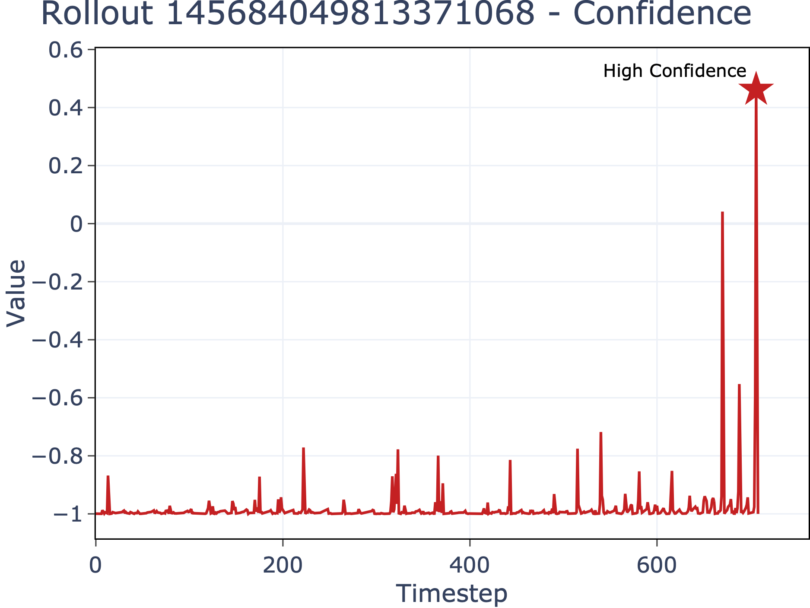 | 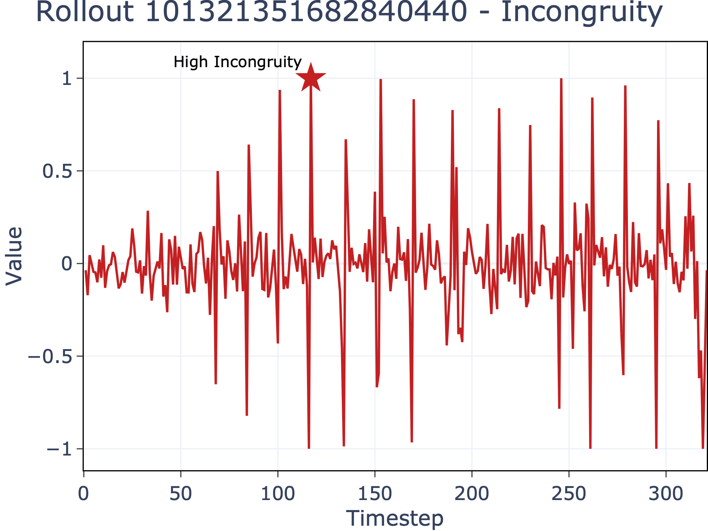 |
| -------------------------------------------------- | --------------------------------------------------- |

If video replays exist for each sampled agent rollout, the script will also generate the videos summaries corresponding to each highlight, e.g.:

|  |  |
| -------------------------------------------------- | --------------------------------------------------- |

## Example

We provide a shell script available at `scripts/05_highlights.sh` to identify highlights of the RL policy in the Breakout environment based on the extracted interestingness data.

# 6. Feature Importance

Feature importance analysis allows us to gain deeper insight into which task elements most affect an agent's competence, how they affect the agent's behavior as measured by interestingness, and where (in which situations) this occurs (see the paper for more details).

## Usage

In `IxDRL`, to perform feature importance analysis over the collected interestingness data we should use the script at `ixdrl/bin/feature_importance.py`: 

```shell
python -m ixdrl.bin.feature_importance
    --interaction-data INTERACTION_DATA
    --interestingness INTERESTINGNESS
    --output OUTPUT
    [--highlights HIGHLIGHTS]
    [--seed SEED]
    [--processes PROCESSES]
    [--format FORMAT]
    [--clear CLEAR]
    [--verbosity VERBOSITY]
    [--clusters CLUSTERS]
    [--cluster-col CLUSTER_COL]
    [--rollout-col ROLLOUT_COL]
```

where:

- `interaction_data`: Pickle file containing the interaction data collected using `bin.collect.*` scripts.
- `interestingness`: Path to pandas dataframe pickle file containing the interestingness data, produced by the `bin.analyze` script.
- `output`: The path to the directory in which to save the results.
- `highlights`: Path to CSV file containing the highlights/outliers info for which to produce local/individual explanations.
- `seed`: Seed used for random number generation.
- `processes`: Number of processes for parallel processing. Value < 1 uses all available CPUs.
- `format`: The format of image files.
- `clear`: Clear output directories before generating results.
- `verbosity`: Verbosity level.
- `clusters`: The path to the clusters CSV file to be used, containing a reference for the replay file of each trace and corresponding cluster. Feature importance will be computed for the data in each cluster and saved to separate directories. If `None`, highlights will be computed for the whole data.
- `cluster_col`: The name of the column in the clusters file holding the information on the cluster id for each rollout.
- `rollout_col`: The name of the column in the clusters file holding the information on the id for each rollout.

<u>*Note:*</u> it might take a while to train the surrogate models and perform global and local feature importance analysis, depending on the number of features and generated rollouts.  

After executing the script, the following subdirectories are created under `output`:

- `data`: contains the input (`features`) and output (`targets`) datasets created to learn the surrogate models via gradient boosting for each interestingness dimension.

- `models`: contains the trained surrogate models for each interestingness dimension.

- `regression-eval`: contains plots with the evaluation of the trained surrogate models for each interestingness dimension under different metrics.

- `hyperparam-optimization`: contains plots showing the impact of the hyper-parameter optimization procedure while training the surrogate models for each parameter.

- `model-feature-importance`: contains plots showing feature importance analysis performed using the XGBoost toolkit (i.e., not using SHAP analysis).

- `global-feature-explanations`: contains the global analysis results (see more details below).

- `local-feature-explanations`: contains the local analysis results (see more details below).

## Global Analysis

The goal of the global interpretation of interestingness is to understand how distinct aspects of the task influence interestingness in general. The 

The `global-feature-explanations` subdirectory generated by the `feature_importance` script contains, for each interestingness dimension, several plots illustrating the SHAP values obtained for each observation feature, the SHAP interaction values and effects between features, e.g.:

| 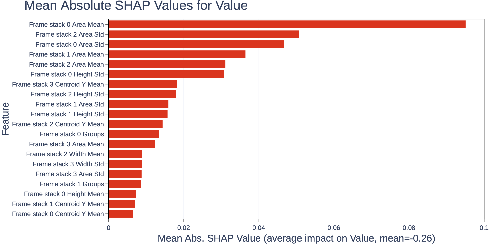 | 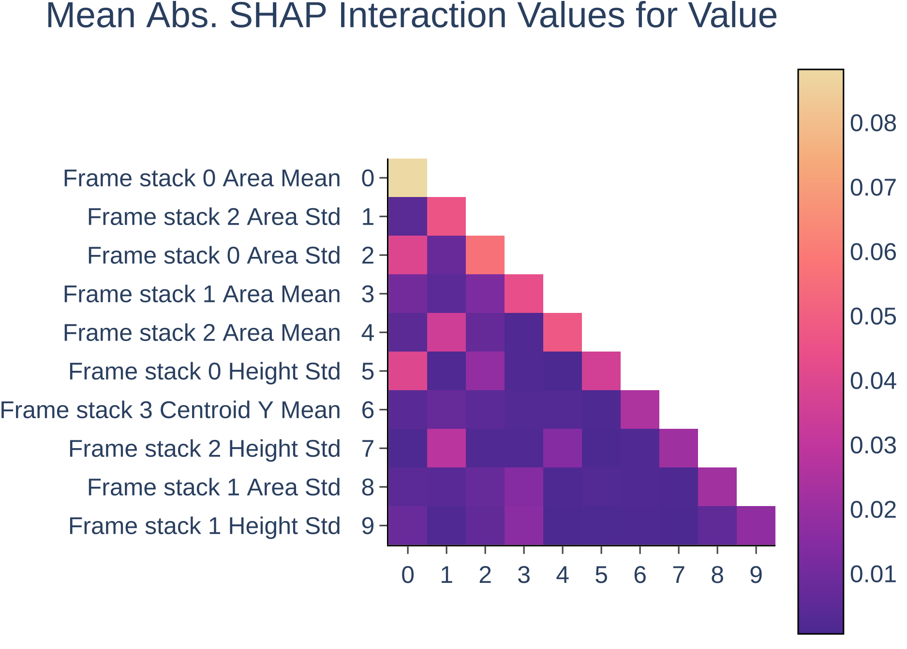 |
| ---------------------------------------- | ----------------------------------------------------- |

## Local Analysis

We use local interpretation of interestingness to understand particular *key* moments of the agent's interaction with the environment. 

The `local-feature-explanations` subdirectory generated by the `feature_importance` script contains, for each identified outlier (identified using the `ixdrl/bin/highlights.py` script), the SHAP values (contribution relative to the mean) impacting the prediction of the different interestingness dimensions, e.g.:

| 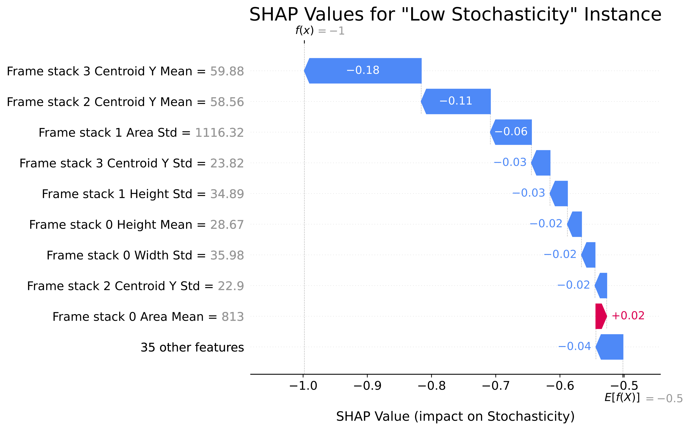 | 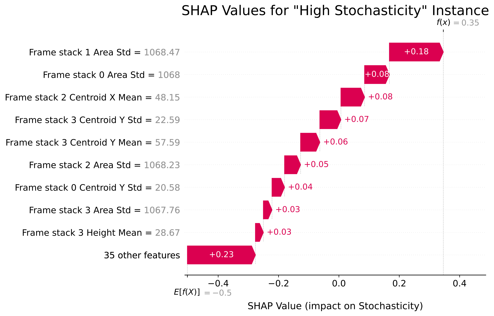 |
| ----------------------------------------------------- | ------------------------------------------------------ |

## Example

We provide a shell script available at `scripts/06_feature_importance.sh` to perform feature importance of the RL policy in the Breakout environment based on the collected interaction data, extracted interestingness data and identified highlights.

# 7. GUI Tool

The `IxDRL` toolkit provides an interactive graphical tool (webapp) built using `streamlit` that allows visualizing videos of traces (replays), select a dimension and sort traces by mean interestingness value, and see the various plots automatically produced by our framework during interaction data extraction and interestingness analysis (see installation requirements above).

## Usage

To load the tool, run:

```shell
streamlit run ixdrl/gui/inspector.py \
    --theme.base dark \
    -- \
    --interaction INTERACTION_DATA \
    --interestingness INTERESTINGNESS_DATA \
    [--training TRAINING_INFO] \
    [--video VIDEO_DIR]
```

where:

- `interaction`: The directory containing the interaction data for a series of rollouts.

- `interestingness`: The directory containing the interestingness analyses results for a series of rollouts.

- `training`: The path to a CSV file containing information about the agent\'s training progress.

- `video`: The path to the root directory of video files defined in the rollouts data. If not provided, the video path for a rollout as specified in the interaction data will be used.

This will launch a web-browser displaying the interactive application:

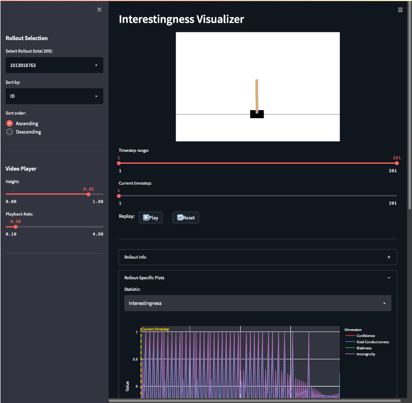

Use the side bar to select the agent rollout to inspect, and the main window to interact with the video replay and plots of interaction and interestingness data.

# License Notice

The code is provided under the GPLv3 license (see [full license file](LICENSE.md)). To use the code under a different set of licensing terms, please contact [SRI International](https://www.sri.com/)'s licensing department at [licensee-ops@sri.com](mailto:licensee-ops@sri.com).

# Support

If you have questions about using this package or find errors in the code you can post an issue or contact [Pedro Sequeira](mailto:pedro.sequeira@sri.com) or [Melinda Gervasio](mailto:melinda.gervasio@sri.com).

# Acknowledgements

This material is based upon work supported by the Defense Advanced Research Projects Agency (DARPA) under Contract No. HR001119C0112.